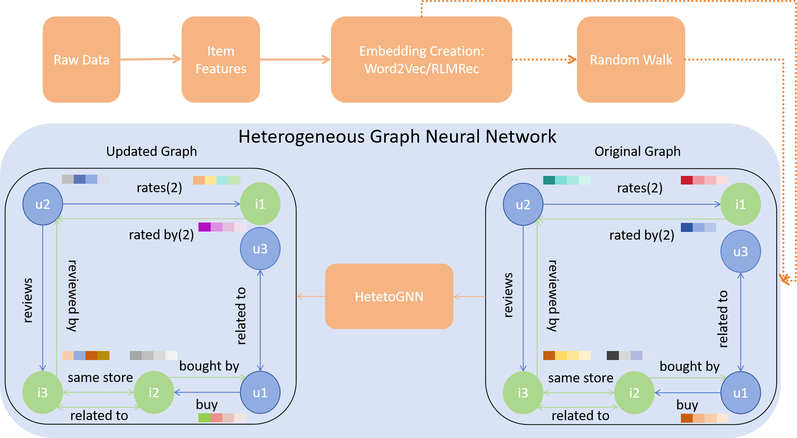

# TRWH: A Text-Driven Random Walk Heterogeneous GNN for Semantic-Aware Sparse Recommendation



# Our results
| Model              | RMSE    | MAE    |
|--------------------|---------|--------|
| MF                 | 1.1973  | 0.9461 |
| MLP                | 1.3078  | 0.9597 |
| P5                 | 1.2843  | 0.8534 |
| ChatGPT (few-shot) | 1.0751  | **0.6977** |
| Homogeneous GNN    | 1.18    | 1.69   |
| **W2VRHet [*]**     | 0.9327  | 0.8496 |
| **LLMRHet [*]**     | 0.9134  | 0.8533 |
| **W2VHet [*]**      | 0.9204  | 0.8549 |
| **LLMHet [*]**      | **0.8944** | 0.8421 |

> Table 2: Performance on Beauty Dataset; [*] denotes our proposed methods.
# Dataset
In this paper，we apply Amazon 2023 review dataset to evaluate our experiments - Amazon All_Beauty and Fashion.

Link: https://amazon-reviews-2023.github.io/

After downloading the datasets, including review data and meta data, create a directory - Datasets, put these four .jsonl files into it. Next, use the "json_to_pkl_transformation" file in Codes directory to convert .jsonl to .pkl.

# Environment setup
```bash
git clone https://github.com/Kyro-Ma/TRWH.git
cd TRWH

pip install -r requirements.txt
```
Our experiments were conducted on both Linux and Windows platforms using Python 3.12. The LLMs-based experiments were conducted on a Linux system equipped with 8 40GB A100 GPUs, while the Word2Vec-based experiments were performed on a Windows system with a NVIDIA RTX 4080 GPU. The CUDA versions used were 12.0 on Linux and 12.6 on Windows. For PyTorch, we used version 2.6.0+cu118 on Linux and 2.7.0+cu126 on Windows.

# Training and Evaluation
In Codes directory, each file represents one of our proposed methods. 

```bash
cd Codes

python <LLMHet.py/LLMRHet.py/W2VHet.py/W2VRHet.py> # sekect one of methods
```
